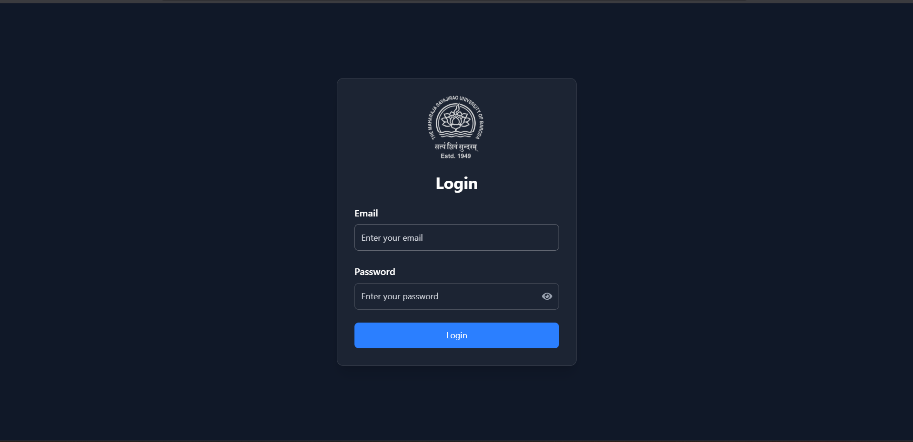

# Project Screenshots

## Login

  
The login page where users can securely sign in with their credentials.

---

## Timetable Manager Homepage

  
The main dashboard of the Timetable Manager, providing access to timetable management features.

---

## Add Timetable Entry

  
Form for adding a new timetable entry with details such as subject, staff, time, and location.

---

## Edit Timetable Entry

  
Interface for modifying an existing timetable entry.

---

## Delete Timetable Entry

  
Confirmation dialog for deleting a timetable entry.

---

## View Staff Details

  
Displays detailed information about staff details.

---

## View Location Details

  
Displays details information about location details.

---

## View Timetable

  
View Timetable in proper format.

---

## Download Timetable

  
View of Downloaded Timetable.

---

## Admin – User Management

  
Admin panel for managing application users, including creating and removing accounts.

---

## Admin – Role Management

  
Admin panel for managing different user roles in the system.

---

## Admin – Role Allocation

  
Admin interface for assigning roles to users.

---

## Admin – Role Deallocation

  
Admin interface for removing roles from users.
